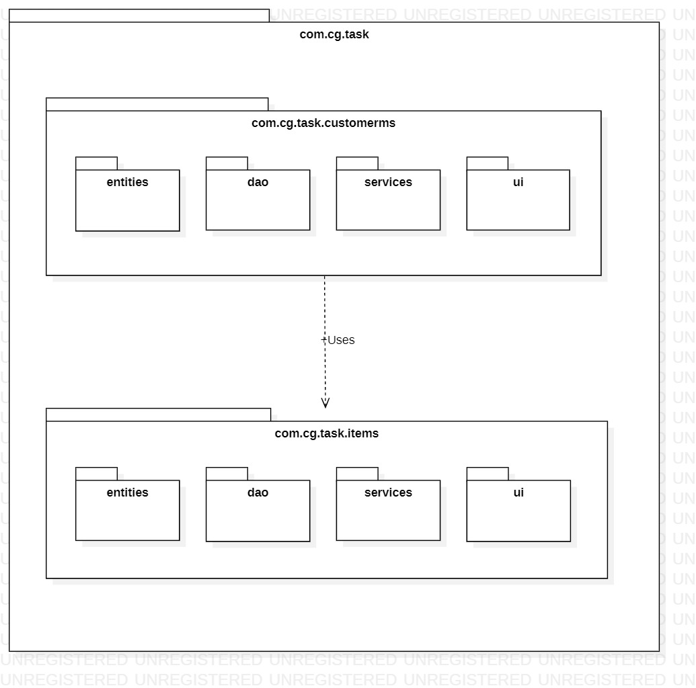

# CG Sprint Practice

A reference repo for the tasks given for the sprint practice. Refer below for class definitions and tasks to be implemented as a Spring-Data-JPA Project.

**Note: DO NOT commit to this repo. All stray commits will be rolled back.**

## Package Structure

## Class Definitions

### Entities

#### Customer

    class Customer{
        id: Long
        name: String
        account: Account
        boughtItems: Set<Items>
    }

#### Account

    class Account{
        accountID: Long
        balance: Double
        created: LocalDateTime
    }

#### Item

    class Item {
        id: String (generate your own)
        price: Double
        description: String
        boughtBy: Customer
        addedDate: LocalDateTime
    }

### Data Access Objects

#### ICustomerDAO

    interface ICustomerDAO {
        Customer add(Customer customer);
        Customer findByID(Long customerID);
        Customer update(Customer customer);
    }

#### IItemDAO

    interface IItemDAO {
        Item add(Item item);
        Item update(Item item);
        Item findByID(String itemID);
    }

### Service Layer

#### ICustomerService

    interface ICustomerService {
        Customer findByID(Long customerID);
        Customer createCustomer(name); //create customer and their account also here
        Set<Item> itemsBoughtByCustomer(Long customerID);
        Customer addAmount(Long customerId, double amount);
    }

#### IItemService

    interface IItemService {
        Item create(Double price, String description);
        Item findByID(String itemID);
        Item buyItem(String itemID, Long customerID);
    }

## Tasks to be done

#### Sprints

- **_Sprint 1:_** Setup boot, JPA container managed transaction project.

- **_Sprint 2:_** Create Customer module without items module (skip relation part) using layered architecture. In console UI, print customer add(), find() operation outputs.

- **_Sprint 3:_** Create Items module (skip relation field with Customer part) using layered architecture. In console UI, print items add(), find() operation outputs.

- **_Sprint 4:_** Add relationship between Customer and Item. Improve the part where Item is to be saved with Customer now. Check if relationship is working by printing details of item and it's customer, and customer with all the items he has bought.

- **_Sprint 5:_** Open REST endpoints for customers.

- **_Sprint 6:_** Open REST endpoints for items.

#### REST endpoints

Open REST endpoints for the following operations:

1. Get customer details by ID (customer ID, name, account ID, balance).
2. Get item details by ID (item ID, price, description, customer ID, customer name).
3. Endpoint for customer to buy item.
4. Find all items bought by customer.
5. Add balance amount to the customer's account; the REST endpoint should accept customer ID and balance in PUT request.

Commit your code to your own repositories.